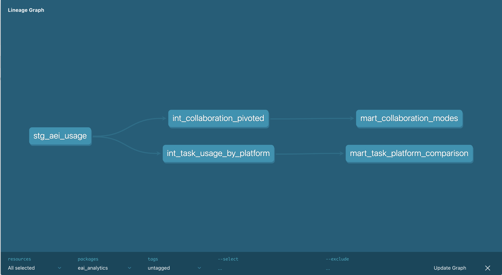
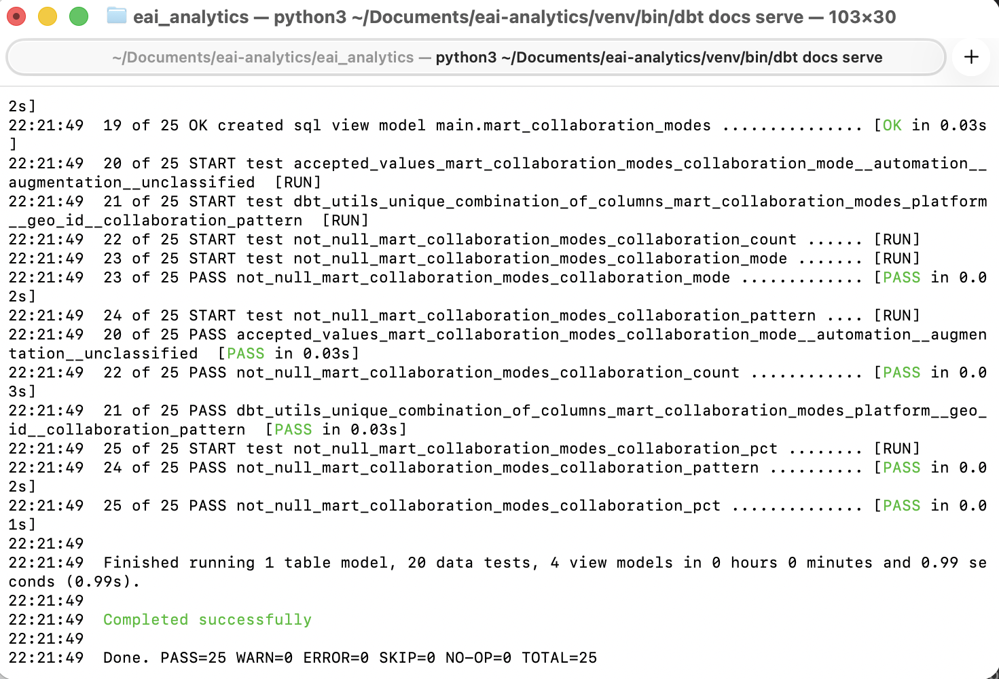
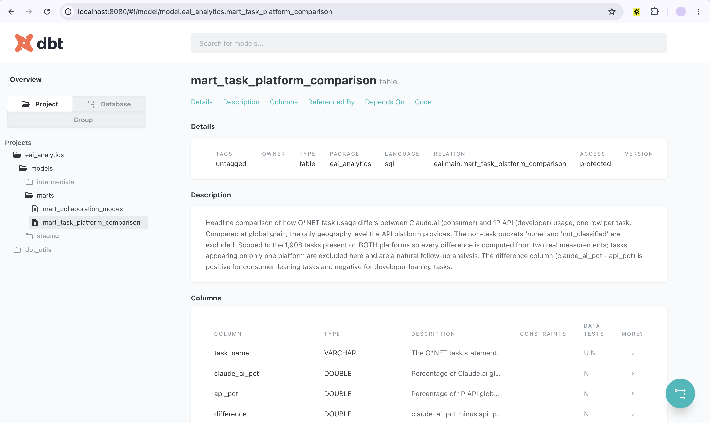
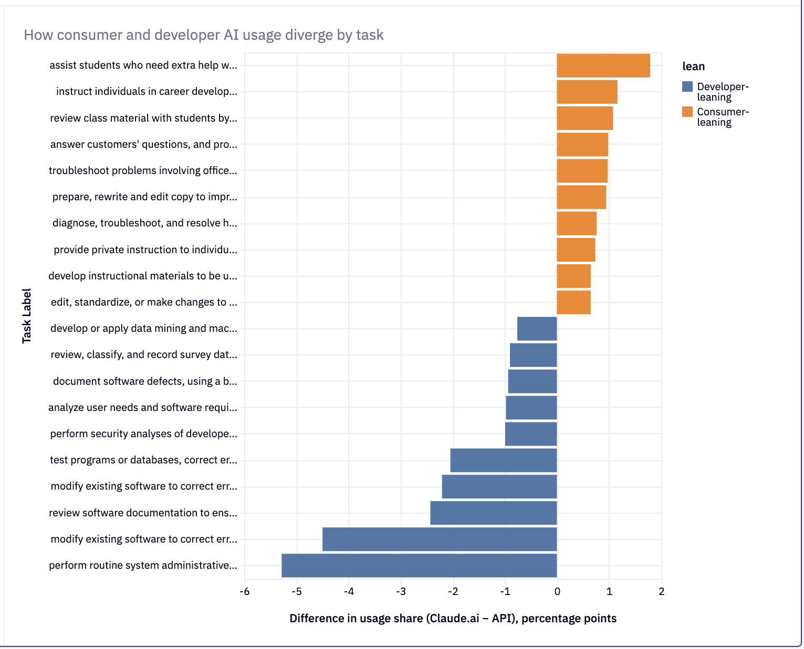
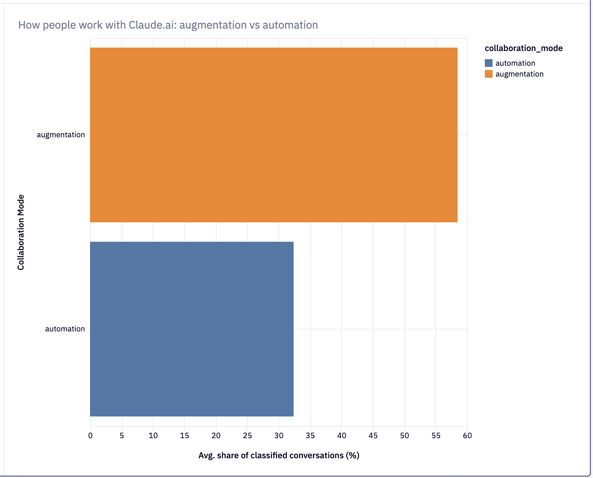

# Economic Index Analytics

An analytics-engineering project built on Anthropic's open [Economic Index](https://www.anthropic.com/economic-index) data. It takes the raw published usage data and models it the way a production analytics pipeline would: a layered dbt project on DuckDB, tested and documented at every step, with two dashboards built in Hex on top.

The goal was less to find a brand-new insight and more to demonstrate the engineering discipline that turns raw, published data into clean, trustworthy, analysis-ready models, the same kind of work an analytics engineer does day to day.

---

## What this project does

The Economic Index ships as two large CSVs (~140MB total): one for Claude.ai consumer usage and one for 1P API usage. Both are in a long, "tidy" format, one row per metric, which is flexible to publish but can't be analyzed directly. This project reshapes that into canonical, documented models and answers two questions:

1. **How does consumer vs. developer AI usage differ by type of work?**
2. **Do people use Claude.ai to work *with* the model (augmentation) or to hand off tasks (automation)?**

---

## Architecture

Raw CSVs to staging to intermediate to marts, all in dbt, orchestrated as a single `dbt build`.



| Layer | Model | Purpose |
|-------|-------|---------|
| Staging | `stg_aei_usage` | Reads both raw CSVs with DuckDB, tags each by platform, unions into one cleaned long-format source |
| Intermediate | `int_collaboration_pivoted` | Pivots collaboration metrics from long to wide (Claude.ai) |
| Intermediate | `int_task_usage_by_platform` | Isolates global O*NET task usage percentages per platform |
| Mart | `mart_collaboration_modes` | Groups collaboration patterns into augmentation / automation / unclassified |
| Mart | `mart_task_platform_comparison` | Compares task usage share between Claude.ai and API, with a divergence metric |

The pipeline runs end-to-end with one command and validates itself with ~20 tests (not-null, accepted-values, and grain-uniqueness checks).



Every model is documented and tested. Each one carries a description explaining its purpose and any scoping decisions, with tests attached at the column and grain level:



---

## Findings

### 1. Consumer and developer usage diverge sharply by task



Developer (API) usage concentrates heavily in software engineering and IT operations, system administration, modifying software, testing programs, reviewing documentation. Consumer (Claude.ai) usage leans towards education and communication, helping students, career instruction, editing writing, answering customer questions, etc. API usage is also more concentrated: a handful of engineering tasks dominate, while consumer usage is spread across many tasks.

The comparison is scoped to the 1,908 tasks present on **both** platforms, at the global level (the only geography level the API data provides), so every difference is computed from two real measurements.

### 2. People mostly work with Claude.ai, rather than delegating to it



Grouping collaboration patterns into augmentation vs. automation, augmentation accounts for roughly **58%** of classified Claude.ai conversations and automation roughly **32%**. People predominantly collaborate with the model (learning, validating, iterating) rather than simply handing off tasks.

Note: the augmentation/automation grouping is my applied interpretation of the Economic Index's framing, not Anthropic's official categorization. The direction is consistent with what Anthropic has reported.

---

## Design decisions

A few scoping choices were deliberate and are documented in the model files:

- **Collaboration scoped to Claude.ai only:** The API platform had just 12 collaboration rows (vs. ~9,400 for Claude.ai), too sparse to analyze, so it's excluded with a documented reason rather than silently included.
- **Platform comparison built on onet_task, not collaboration or task_success:** I originally expected to compare platforms on collaboration patterns, but validating coverage showed the API side was too sparse there. Task usage had solid coverage on both platforms, so the comparison was built there instead.
- **Comparison limited to tasks on both platforms:** A task missing from one platform isn't reliably "zero", it may be below a reporting threshold, so single-platform tasks are excluded from the head-to-head and flagged as a possible follow-up.

---

## Tech stack

- **dbt** (transformation, testing, documentation)
- **DuckDB** (local warehouse; SQL transfers directly to Snowflake/BigQuery)
- **dbt_utils** (grain-uniqueness testing)
- **Hex** (dashboards)
- **Python** (data export)

---

## How to Run it

The raw data files are not committed (they're large and are Anthropic's to distribute). To reproduce:

1. Download the latest release CSVs from the [Economic Index dataset](https://huggingface.co/datasets/Anthropic/EconomicIndex) and place them in `data/raw/`.
2. Update the filenames in `dbt_project.yml` under `vars:` if needed.
3. Set up the environment and run:

```bash
python3 -m venv venv
source venv/bin/activate
pip install dbt-duckdb
dbt deps
dbt build
```

4. Explore the docs and lineage graph:

```bash
dbt docs generate
dbt docs serve
```

---

## Walkthrough
A short video walkthrough of the pipeline and findings is available [here] (https://www.loom.com/share/fa0e840065174f7cba9443387177ad1f)

---

*Built as an independent project using Anthropic's publicly released, CC-BY-licensed Economic Index data.*